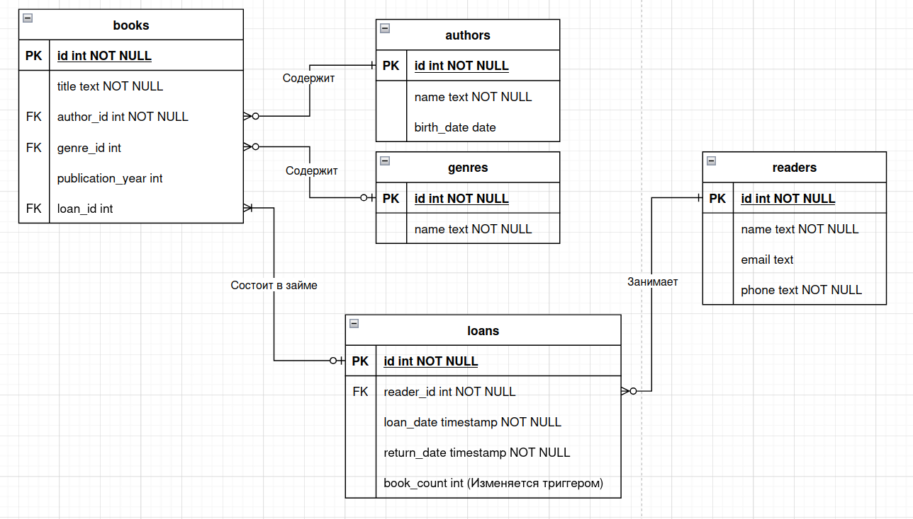

# library-db

## Введение
Лабораторная работа содержит в себе проектирование реляционной базы данных с помощью СУБД **Postgres** и реализация GUI библиотеки в качестве предметной области при помощи **Python Tkinter**

## [ER-Диаграмма](er-diagram.drawio)

## Основные требования
- **Python 3.12+** 
- **Postgres SQL** - Реляционная СУБД
- **psycopg2** - библиотека предоставляющая API для работы с Postgres
- **tkinter** - библиотека для создания графического интерфейса

## Особенности приложения

- **Создание** базы данных, её инициализация, создание соответствующих таблиц, функций/процедур их триггеров
- **Очистка** полной информации (всех таблиц)
- Управление библиотекой
	- **Добавление / Удаление / Изменение** книг, их авторов и жанров
	- **Вывод** и просмотр информации о книгах, читателях
- Управление читателями
	- **Регистрация** читателей в библиотеке, **удаление**, **изменение**
	- Просмотр информации о читателях и о их займах (дата оформления, дата возврата, количество книг в займе)
- Управление займами
	- **Просмотр информации о своих займах**: забронированные книги, дата оформления, дата возврата
	- **Бронирование книг** (создание займа) из числа свободных
	- **Возврат** забронированной книги
